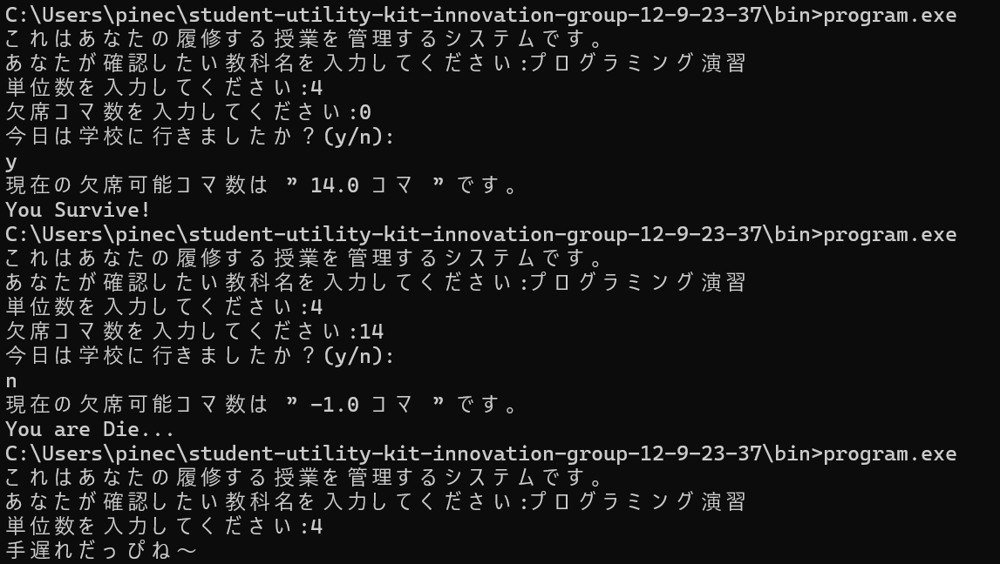

# 学生生活支援キット開発プロジェクト (Student Utility Kit Innovation)

> ⚠️ **NOTICE / 注意**
> このREADMEはテンプレートです。**自分たちのプロジェクトの内容に書き換えてください**。
> （タイトル、テーマ、メンバー名、ファイル名、ビルド手順、デモ動画リンクなどを差し替える）
> *This is a template. Please edit and customize every section for your actual project.*

---

## 1. プロジェクト概要

授業の出席コマ数を計算して管理するシステム．

- 期間: 3週間
- 班構成: 光野、篠原、江藤

---

## 2. テーマ一覧（班ごとに1つ・重複なし）

| # | テーマ | 内容 |
|---|---|---|
| 01 | 課題管理 (TODO) | 締切と優先度から課題を優先順位付け |
| 02 | 成績シミュレータ | 単位取得に必要な期末点を計算 |
| 03 | 暗記フラッシュカード | テキストから単語を出題、正解率を記録 |
| 04 | 時間割最適化 | 空き時間から自習プランを提案 |
| 05 | グループ経費精算 | 最少送金回数で割り勘 |
| 06 | ファイル整理キット | 拡張子・日付で自動分類 |
| 07 | 集中タイマー (Pomodoro) | 集中時間をログ・グラフ化 |
| 08 | 出席記録システム | 単位を落とす前に警告 |

---

## 3. 班構成（役割分担）

| メンバー | 役割 | 担当ファイル |
|---|---|---|
| 篠原 | メインロジック（計算・判定） | `logic.c` `logic.h` `main.c`|
| 光野 | データ管理（ファイルI/O） | `storage.c` `storage.h` |
| 江藤 | UI（メニュー・入力チェック） | `ui.c` `ui.h` |

全員がGitで互いのプルリクエストをレビュー。

---

## 4. ビルド方法

### 必要なもの

- C コンパイラ (`gcc` または `clang`)
- `make`
- Git

### プラットフォーム別セットアップ

**Windows (MSYS2 / MinGW)**
```bash
pacman -S mingw-w64-x86_64-gcc make
```
### ビルドと実行

```bash
git clone https://github.com/NIT-Oita/student-utility-kit-innovation-group-12-9-23-37.git
cd student-utility-kit-innovation-group-12-9-23-37.git
make      # コンパイル
cd bin    
program.exe     # 実行（Windowsは taskman.exe）
```

### Makefile ターゲット

| コマンド | 動作 |
|---|---|
| `make` | コンパイル＆リンク |
| `make clean` | 中間ファイルを削除 |

---

## 5. プロジェクト構成

```
your-project/
├── Makefile
├── README.md
├── .gitignore
├── src/
│   ├── main.c
│   ├── ui.c   ui.h
│   ├── logic.c logic.h
│   ├─── storage.c
│   └── data.csv
└── data/
    └── tasks.csv

```

---

## 6. データ形式（例）

`data.csv` の形式:

```data
a,1.0
国語,3.0
rty,2.0

```

---

## 7. Gitワークフロー

```bash
git pull origin main                    # 最新を取得
git checkout -b （uif等）     # 機能ごとにブランチ
# ... コード変更 ...
git commit -m "ver 1.21"
git push  # PR作成 → レビュー → マージ
```

---

## 8. テストチェックリスト

- [●] 負の数値や0を入力しても落ちない
- [●] 空入力（Enterのみ）を処理できる
- [●] データファイルが無い場合に新規作成
- [●] 壊れたデータ行を無視・警告
- [●] すでに手遅れな教科は単位数入力の後拒否

---

## 9. 評価基準（100点）

| 項目 | 配点 | 内容 |
|---|---:|---|
| 機能性 | 30 | 全機能が正しく動作 |
| コード品質 | 20 | モジュール化・警告ゼロ・命名 |
| Git共同作業 | 15 | ブランチ・PR・3人均等のコミット |
| テスト・堅牢性 | 15 | 不正入力で落ちない |
| ドキュメント | 10 | README・Makefile・コメント |
| デモ・独創性 | 10 | 5分ライブデモ |
| **合計** | **100** | 合格: 60点／優秀: 85点以上 |

---


---

## 10. メンバー / Members

- ** メンバー A ** — 光野悠斗 (s2538) — `s2538@oita-kosen.ac-jp`
- ** メンバー B ** — 篠原空馳 (s2523) — `s2523@oita-kosen.ac-jp`
- ** メンバー C ** — 江藤はる (s2509) — `s2509@oita-kosen.ac-jp`

班番号: ** Group 12 **

---

## 12. デモ動画 / Demo

> プロジェクト完成後、ここにデモ動画またはスクリーンショットを追加してください。

---

## ライセンス

学内提出用。商用利用なし。
